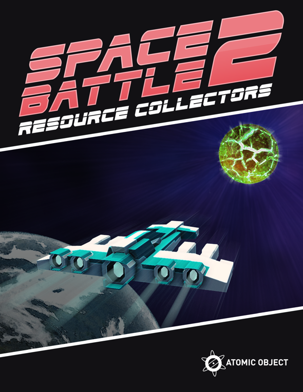

# Atomic Games

## Goal

Write an AI to command your troops to gather the most resources in the time allotted. Explore the map, gather resources, expand your forces, and eliminate your opponents!

## Details

Spaces Battles 2: Resource Collectors is a real-time strategy (RTS) game. This means both players are performing actions simulateously within the same map. Read more about [gameplay here](./docs/gameplay.md).

The AI you will write is responsible for observing the state of the map, deciding how to react, and sending commands to your troops without any human input.

## Starter Kit SDKs

Starter Kit SDKs are provided in several languages to get you started.

These SDKs handle server connection logic, parameter parsing, and a naive implementation of a client that makes random moves.

Each SDK has a README that describes how to use the client.

- [Node.js](./sdks/node/README.md)
- [Java](./sdks/java/README.md)
- [Python](./sdks/python/README.md)
- [C#](./sdks/cs/README.md)
- [Clojure](./sdks/clojure/README.md)
- [Ruby](./sdks/ruby/README.md)

## Documentation

- [Gameplay](./docs/gameplay.md): defines the objectives, rules, and mechanics of the game
- [Game Loop](./docs/game_loop.md): describes how the game proceeds and provides insight into your objectives as a developer
- [Protocol Spec](./docs/protocol_spec.md): reference for how the server will talk to your client and how your client is expected to talk to respond
- [Tiny Example](./docs/tiny_example.md): a small scale example of some game concepts and a few turns of the game loop
- [Running your own server](./server/README.md): setting up a server on your own machine (if you're on Windows you may want to ask a coach for assistance)
- [Custom Maps](./docs/custom_maps.md): for testing weird edge cases or to make a custom matchup with a friend

## Tips

- Use the tools available to you
  - Documentation
  - Google
  - LLMs
  - Coaches
- Save your work using Git!
  - When your client works and does something interesting make a commit/tag/branch.
  - Need a git refresher? Try [commits](https://git-scm.com/book/en/v2/Git-Basics-Recording-Changes-to-the-Repository#:~:text=Committing%20Your%20Changes), [using tags](https://git-scm.com/book/en/v2/Git-Basics-Tagging), or [named branches](https://git-scm.com/book/en/v2/Git-Branching-Branches-in-a-Nutshell)
- Get a client running aginst a server ASAP! Regularly make sure your client can still connect and run.
- Don't spend all of your resources early.
  - Hypothetical: you immediately buy a new unit, your opponent does nothing all game, you fail to collect any more resources...your opponent wins.
