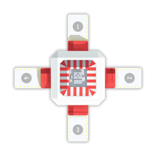
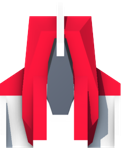
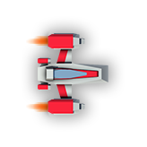
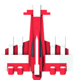

# Gameplay

## Objective

The player that gathers the most resources and returns them to their base wins!

Ties will be broken by the team that has explored the most of the map.

Rounds will last 5 minutes by default, but can be configured to be longer or shorter.

## The Map

Each round will be played on a randomized map (a grid of tiles). A variety of sample maps are available in the game server, but custom maps can be used. More on custom maps [here](./custom_maps.md).

Each team will have a **base** randomly placed on the map. Your base is where your units will spawn and where you must return resources to.

The terrain of the map is defined by walls which units cannot move through.

**Resources** will be scattered across the map. Resources come in different sizes. You may not be able to gather the full value of a resource in one go. Gather what you can, return to base, and then come back for more.

Your opponent inhabits the same map. While exploring and collecting, you may run across an enemy troop or base. Get the resources before they can!

## Units

Units are your eyes and hands on the map. You can only see the portions of the map that are in the vicinity of your units. Units come in three types: workers, scouts, and tanks.

At the start of the game, 6 worker units will spawn at your base.

**Workers** have average vision, health, and speed. They are the only units that can carry resources. The can perform a weak melee attack. These are the cheapest units.

**Scouts** have higher vision and speed than workers, but lower health. They also have a weak melee attack. Scouts have a medium price.

**Tanks** have average vision, high health, and low speed. Tanks are the only units with a ranged attack. They are the most expensive units.

### Attacks

Attacks deal damage to an enemy unit. The amount of damage an attack does varies by unit.

Attacks have a cooldown period that also varies per unit to prevent attack spamming. Commands for additional attacks within the cooldown period will be ignored.

Attacks will damage any unit at the target location (including your own).

**Melee attacks** are only effective if the target is within 1 tile of the attacker. Commands for a melee attack out of range will be ignored.

**Ranged attacks** can taget enemies further away. A unit with a ranged attack can shoot an enemy unit anywhere within its vision range.

| type   | cost | vision range (+/-) | speed (tpt\*) | health | attack cooldown (turns) | attack damage | build time (turns) |
| ------ | ---- | ------------------ | ------------------------ | ------ | ----------------------- | ------------- | ------------------ |
| worker | 100  | 2                  | 5                        | 10     | 3                       | 2             | 5                  |
| scout  | 130  | 5                  | 3                        | 5      | 3                       | 1             | 10                 |
| tank   | 150  | 2                  | 10                       | 20     | 7                       | 4             | 15                 |

\***turns per tile (tpt):** Number of turns required to move from one grid location to the next. Smaller is faster.

## Commands

Commands are your AI's way of telling the server what you want your units to do. On each turn there are several actions you can take, they are described below.

You may make many commands on a single turn (e.g. move one unit, move another unit, gather resources with another unit, attack with a fourth, etc) You should batch all of your commands for a single turn into one request.

Some commands take many turns to complete. When finished executing a command, a unit's status will be set to idle. If you make a command for a unit when its status is not idle, it will be ignored.

When a unit dies its status will be set to 'dead'. Dead units do not respond to commands 💀

**MOVE**: Move a unit in any cardinal direction (N, S, E, W). Units will ignore commands to move into walls. Multiple units may occupy the same tile.

**GATHER**: Collect resources from a tile adjacent to the unit.

**DROP**: Deposit some amount of the resources that a unit is carrying to an adjacent tile. A unit carrying resources will automatically deposit all when they move on top of the base, no need to use drop in that circumstance.

**MELEE**: Attack an adjacent cell. This command will be ignored if no target is present in the specified cell or if the attacker is in attack cooldown.

**SHOOT**: Shoot a target within the unit's vision range. This command will be ignored if the target is outside of the unit's vision range, no target is present, or the attacker is in attack cooldown.

**CREATE**: Purchase a new unit of a specified type. The unit will be created at the player's base. The cost of the unit is deducted from the player's resource total. This command is ignored if the player does not have enough resources.

**IDENTIFY**: Give a name to the specified unit. This name will only show on the server's graphical window, it should not be relied on for identifying units at a server communication level. You can only identify your own units.
